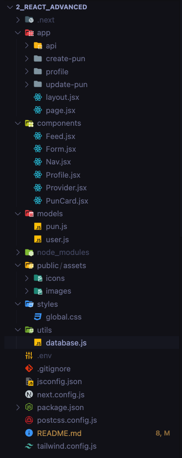
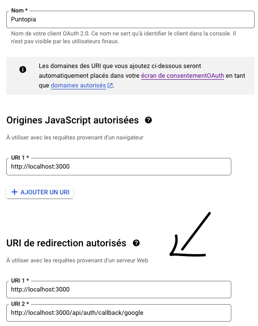

# Puntopia

Puntopia is a Open-source Community sharing tool to discover, create and share funny puns!

the app allows this:
- need to sign up to google Auth0 to post puns (we need to know who did what :) ) 
- CRUD operation for Puns
- search puns from tags, user, and text in puns
- see other user profile.
- Store and Load date from a MongoDB Database.

# Becode requirement

- Repository: `advanced-react`
- Mode: `solo`
- Type of Challenge: `consolidation`
- Duration: `4+1 days`
- Deployment: `Github pages` or `Netlify`

## Intro

We expect you to know how to use React hooks and create JSX components.
You should also be familiar as for how to route between components and pass information through them.

Now, we can use that new knowledge to have some fun!

## Instructions

You will have a week.

You are free to choose a topic for your project (or use suggested projects below). But should not be spending more than an hour finding a topic!

**All topics need to have all the following requirements given below as well.**

### Requirements

> Using a router
>
> Multiple pages/components.
>
> Updating data on change/filter.
>
> Loading data on page load.
>
> Installing a package/library to use
>
> Passing props through components.

# What did i do

## next.js

I decided for this assignement to use Next.js instead of pure REACT, why?

- Next.js routing system is way easier and simple to use (and allow easy dynamic routes).
- Next.js allows interaction with databases, which allows me to develop FullStack apps instead of pure frontend apps.
- Next.js allows to manage to works with router depending of the method you use from a URL.
- Doc of react itself preconize to use frameworks to code react apps.
- Next.js by default works on server side, if client sided component would be needed, the first line of the component needs **"use client"** code. [More info Here](https://nextjs.org/docs/getting-started/react-essentials#when-to-use-server-and-client-components)

## Other technologies used.

- MongoDB
- TailwindCSS
- Google 0auth
- bcrypt

## Files Structure

<details>
<summary>Click here to see the picture of file structure </summary>
 
 
</details>
The App occurs in the app folder, in Next.js, the base layout and page refer to the index of the application.
<br><br>

### Nextjs routing system

Every folder inside the app folder will be equal as a route.
for example, the profile folder with a page.jsx inside would be the same as:

    app
    └── profile
        └── page.jsx


> ```
> http://mysite.com/profile
> ```
>

 for the dynamic routes, an inside folder is created with a name of the parameter you want to be dynamic between **square brackets**.
 In my case, if i click on the email of the user, i can go to his profile and see his post.

so the structure folder would be:

    app
    └── profile
        ├── [id]
        │   └── page.jsx
        └── page.jsx

The code for the link would be like this:

```jsx
<Link
  href={
    post.creator._id === session?.user.id
      ? "/profile"
      : `/profile/${post.creator._id}?name=${post.creator.username}`
  }
>
  {post.creator.username}
</Link>
```

<details> 
<summary> Let's breakdown this link together 😁</summary>

- `<Link`: This is the start of a Next.js `Link` component, which is used for client-side navigation in Next.js applications. It renders an anchor tag (`<a>`) and handles the navigation internally without a full page reload.

- `href={...}`: This is an attribute of the `Link` component. It determines the destination URL that the link will navigate to. In this case, it uses a JavaScript expression as the value.

- `post.creator._id === session?.user.id`: This is a conditional expression that checks if the `_id` property of `post.creator` is equal to the `id` property of `session?.user`. The `?.` is an optional chaining operator that prevents an error if `session` or `session.user` is null or undefined.

- `? "/profile" : /profile/${post.creator._id}?name=${post.creator.username}`: This is a ternary operator. If the condition is true (`post.creator._id === session?.user.id`), it sets the href value to `"/profile"`. If the condition is false, it sets the href value to `/profile/${post.creator._id}?name=${post.creator.username}`. This conditionally generates the correct URL for the link based on the comparison.

- `{post.creator.username}`: This is the content of the `Link` component. It will display the `username` property of `post.creator` as the visible text of the link.

- `</Link>`: This is the closing tag of the `Link` component.

Overall, this code snippet is generating a link to a user's profile page. If the `_id` of the `post.creator` matches the `id` of the `session.user`, the link will navigate to "/profile". Otherwise, it will navigate to "/profile/{post.creator._id}?name={post.creator.username}". The `post.creator.username` is displayed as the visible text of the link.

</details> <br><br>

### The API folder
>
This folder contains the router and logic for authentication. [See documentation Here](https://next-auth.js.org/)
>
In the **Pun** folder, we find the logic and router for the interaction with the Database. I used [Mongoose](https://mongoosejs.com/) to ease the operation (like Schema creation (table creation), and connections with DB).

>- first i imported the logic of connection from the utils folder
>- then i imported the Model of Pun, which contains the Schema for MongoDB.
>- from there i make a function with the method needed wich contains a try/catch method to interact with the DB.

>
### The Component Folder
This folder contains the react component like Navbar, Form, Profile, Puncard, Feed and Providers i use/re-use along the app.
>
### The model Folder
Mongoose needs to have Schema to create the "table" on MongoDB, in this folder i created two models, one for the Puns and the other one for the User.

#### The Pun model
>In this schema, there is a field named creator that represents a reference to a User model. This indicates a one-to-many relationship between the Pun model and the User model.
>
>Specifically, the creator field is of type Schema.Types.ObjectId and is referencing the "User" model using the ref property. This means that each Pun document will have a reference to the corresponding User document as its creator.
>
>With this setup, multiple Pun documents can reference the same User document, creating a one-to-many relationship where one user can be associated with multiple puns.
>
>It's important to note that this code snippet only represents the schema definition and the association between the Pun and User models. The actual relationship between the models will be established when you create and save the documents using Mongoose. 

<details>
<summary>Click here to see the code</summary>

```js
import  {Schema, model, models} from "mongoose";

const PunSchema = new Schema({
//this is here that the relation is created
  creator: {
    type: Schema.Types.ObjectId,
    ref: "User",
  },
//the text of the pun is required and have a String property
  pun: {
    type: String,
    required: [true, "Pun is required"],
  },
//same for the tag
  tag: {
    type: String,
    required: [true, "Tag is required"],
  },
});
const Pun = models.Pun ||  model('Pun', PunSchema);
export default Pun;
```

Let's breakdown the last line of code

```js
const Pun = models.Pun ||  model('Pun', PunSchema);
```

- models.Pun: This part checks if there is already a model named "Pun" defined. The models object represents all the models registered with Mongoose. It looks for an existing model named "Pun" using models.Pun.

- model('Pun', PunSchema): If there is no existing model named "Pun", this part creates a new model using the Mongoose model function. It takes two parameters: the name of the model ("Pun" in this case) and the PunSchema defined earlier. This creates a new Mongoose model with the name "Pun" and the provided schema.

- Pun = models.Pun || model('Pun', PunSchema): The result of this line is assigned to the variable Pun. It either assigns the existing "Pun" model from models.Pun if it exists, or assigns the newly created model using model('Pun', PunSchema) if there is no existing model named "Pun". This ensures that the Pun variable holds a reference to the "Pun" model, whether it already exists or is newly created.

- Overall, this line ensures that the Pun variable holds the Mongoose model for the "Pun" schema, regardless of whether it was previously defined or needs to be created.

</details>

I let you make the same reflection for the user model :)

### Extra infos
i included an .env.example file to get the basic structure of the env file.

It is also important to mention for the auth to work that you need a Callback URI you can specify this URI in the credential of your oauth client on [console.google.com](https://console.cloud.google.com/apis/credentials/oauthclient/)



<!-- did i mention i was french speaking? 😄-->

Thank you for your time and enjoy :)

Sure! Here's a breakdown and comment for each line of the code:

